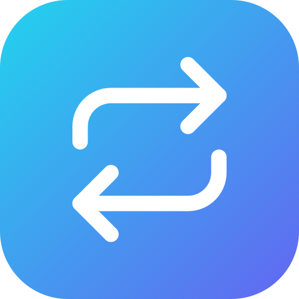
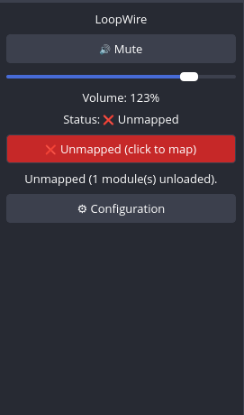
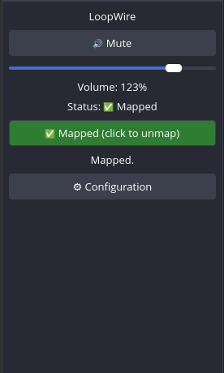
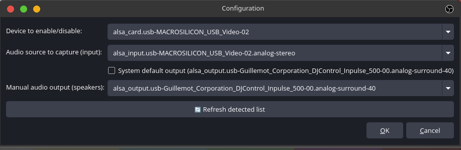

<p align="center">
    
</p>

<h1 align="center">LoopWire</h1>
<p align="center"><strong>🎚️ A native Rust + Qt6 OBS Studio plugin to mute, adjust volume, and route your HDMI-to-USB capture card's audio into your computer's speakers — without leaving OBS.</strong></p>

<div align="center">
    
    
    
    
</div>

---

Built for a specific, annoying problem: an HDMI-to-USB capture card (or any
composite USB audio device) shows up as its own PipeWire/PulseAudio source,
separate from your normal microphone, and needs to be muted/routed
independently — without digging through `pavucontrol`, the system mixer, or
alt-tabbing out of OBS every time.

LoopWire is a **native OBS Studio plugin**, written in Rust with a Qt6 dock
panel, that puts mute / volume / loopback-mapping controls directly inside
OBS, plus an `obs-websocket` vendor API for remote/scripted control
(automation, MCP servers, StreamDeck-style triggers, etc.).

Everything talks to PipeWire/PulseAudio through `pactl` — no shell
interpolation, no raw C buffers, just argument-list subprocess calls from
Rust with the memory safety that implies.

**Linux only.** LoopWire is built directly on top of `pactl` and
PipeWire/PulseAudio semantics (card profiles, `module-loopback`, ALSA card
names) — there is no macOS or Windows target, and none is planned.

**Tested hardware:** a UGREEN "HD USB Video Capture Card" (model **CM489**,
MACROSILICON chipset) — but since nothing is hardcoded to this device (see
[Live device detection](#what-it-does)), any capture card exposing its audio
as a standard USB Audio Class endpoint should work the same way.

## Screenshots

<p align="center">
  
  &nbsp;&nbsp;
  
  &nbsp;&nbsp;
  
</p>
<p align="center"><em>The dock before/after mapping, and the Configuration dialog listing real detected devices.</em></p>

## What it does

- **Mute / unmute** the capture card's input in one click, from a dock
  inside OBS.
- **Volume slider** (0–150 %) for that input specifically.
- **Map / Unmap** — the core feature: routes the audio from your HDMI
  capture card (or USB acquisition dongle) straight into your computer's
  speakers, one click, no mixer needed. Under the hood it loads/unloads a
  PipeWire `module-loopback` between the capture source and your output. A
  single toggle button (green = mapped, red = unmapped), same interaction
  pattern as the mute button.
- **Auto or manual output** — send the loopback to whatever PipeWire
  currently considers the *default* system output, or pin it to a specific
  sink.
- **Live device detection** — the configuration dialog lists the actual
  cards/sources/sinks present on *your* machine (via `pactl list ... short`),
  refreshable on demand. Nothing is hardcoded to a specific card model.
- **Safe profile toggling** — if the capture source hasn't appeared yet,
  the plugin cycles the card profile `off` → `input:analog-stereo` to force
  PipeWire to (re)create the node. This is only done when strictly
  necessary (never on every call), since forcing a profile switch on a live
  composite audio+video USB device can be disruptive to whatever else is
  reading from it.
- **Non-blocking** — a background thread polls status every 2s; OBS's main
  thread only ever reads an already-computed result, so a slow `pactl` call
  never stalls the UI.
- **`obs-websocket` vendor API** — `get_status`, `set_mute`, `set_volume`,
  `map`, `unmap`, `get_config`, `set_config`, so external tools can drive it
  over the OBS WebSocket API.

## Requirements

- Linux with **PipeWire** (via `pipewire-pulse`) or **PulseAudio**, and the
  `pactl` CLI (`pulseaudio-utils` package, or equivalent — installed by
  default on most PipeWire/PulseAudio desktops).
- [OBS Studio](https://obsproject.com/), already installed (don't reinstall
  it through the commands below — it could bump it to a different version
  and break ABI compatibility with the plugin you compile).
- A Rust toolchain, a C++ compiler, Qt6 + OBS Studio development headers,
  `pkg-config`, and `libclang` (used by `bindgen` to read the OBS headers).
  `install.sh` detects your distribution automatically and proposes the
  right command below (nothing is installed without your confirmation) —
  or install manually:

  ```sh
  # Arch / CachyOS / Manjaro — OBS dev headers ship inside the obs-studio package itself
  sudo pacman -S --needed rust clang qt6-base pkgconf

  # Debian / Ubuntu
  sudo apt install cargo rustc clang libclang-dev build-essential \
      libobs-dev qt6-base-dev pkg-config

  # Fedora
  sudo dnf install cargo rust clang clang-devel gcc-c++ \
      obs-studio-devel qt6-qtbase-devel pkgconf-pkg-config
  ```

  Package names verified by actually installing them in throwaway
  containers (not just checking a package index): confirmed working with a
  plain `apt install` on **Debian 13 "trixie"** and **Ubuntu 24.04
  "noble"**, and with a plain `dnf install` on **Fedora 44** — no PPA or
  backports needed on any of them. If a future release ever drops
  `libobs-dev` from its main repos, the official PPA
  (`ppa:obsproject/obs-studio`) is the fallback.

## Install

No precompiled binary is shipped — an OBS plugin is tied to the exact
`libobs`/Qt6 build it was compiled against, so it's built locally against
whatever OBS Studio you actually have installed:

```sh
git clone https://github.com/ITchrisDEB/OBS-Loopwire.git
cd OBS-Loopwire
chmod +x install.sh
./install.sh
```

This compiles the plugin in release mode and installs it to
`~/.config/obs-studio/plugins/loopwire/bin/64bit/loopwire.so`
(user-local, no root needed). Restart OBS Studio afterwards.

## Configuration

The plugin reads and writes:

```
~/.config/loopwire/config.json
```

```json
{
  "card": "alsa_card.usb-<your-device>",
  "source": "alsa_input.usb-<your-device>.analog-stereo",
  "sink": "alsa_output.<your-speakers>",
  "sink_auto": true
}
```

| Field        | Meaning                                                                 |
|--------------|--------------------------------------------------------------------------|
| `card`       | The PipeWire/PulseAudio **card** whose profile gets toggled on/off to make the capture source (re)appear. |
| `source`     | The **input** node to mute/adjust/map — your USB capture device.       |
| `sink`       | The manual **output** node to loop audio into, used only when `sink_auto` is `false`. |
| `sink_auto`  | When `true` (default), the loopback always targets whatever PipeWire currently reports as the system default output (`pactl get-default-sink`), queried fresh each time — never polled in the background. |

There is no built-in default for `card`/`source` — every machine has
different (or no) capture hardware, so these stay empty until set through
the Configuration dialog, which lists what's *actually* detected on your
system. You never need to hand-edit this file — the **⚙ Configuration**
dialog inside the dock does it for you.

## Usage

After installing, look for the **"LoopWire"** dock inside OBS
(**View → Docks** if it's hidden). Configure your card/source/sink once via
**⚙ Configuration**, then use **Mute** / the volume slider / the
**Map/Unmap** toggle day to day.

For scripted/remote control, connect to `obs-websocket` and issue vendor
requests to the `loopwire` vendor:

| Request       | Purpose                                      |
|---------------|-----------------------------------------------|
| `get_status`  | Current mute/volume/mapped state              |
| `set_mute`    | `{ "muted": true/false }`                     |
| `set_volume`  | `{ "volume_percent": 0-150 }`                 |
| `map`         | Load the loopback (mute-off included)         |
| `unmap`       | Unload the loopback                           |
| `get_config`  | Read `card`/`source`/`sink`/`sink_auto`       |
| `set_config`  | Write `card`/`source`/`sink`/`sink_auto`      |

## Building from source

`build.rs` compiles the Qt6 dock shim (`src/dock.cpp`) as a plain C++
translation unit (no `moc`, lambda-only Qt connections — Qt6 flags come from
`pkg-config --cflags Qt6Widgets`, no hardcoded paths) and generates Rust
bindings for the needed `libobs` symbols via `bindgen` (auto-detects the
`obs-module.h` location; override with `OBS_INCLUDE_DIR=/some/path` if it
guesses wrong on your system).

### Manual build (without `install.sh`)

`install.sh` is just these steps with dependency auto-detection and a
confirmation prompt in front — useful to know if you'd rather run them
yourself, or if you're customizing the install path:

```sh
# 0. Get the source (skip if you already have it, e.g. from the Install step)
git clone https://github.com/ITchrisDEB/OBS-Loopwire.git
cd OBS-Loopwire

# 1. Compile in release mode
cargo build --release

# 2. Create the plugin's expected directory layout
mkdir -p ~/.config/obs-studio/plugins/loopwire/bin/64bit

# 3. Install the compiled binary (user-local, no root needed)
install -m 755 target/release/libloopwire.so \
    ~/.config/obs-studio/plugins/loopwire/bin/64bit/loopwire.so
```

Restart OBS Studio afterwards.

## Troubleshooting

- **`error: could not find obs-module.h anywhere`** / **`pkg-config --cflags
  Qt6Widgets` returned nothing** — the OBS Studio or Qt6 development headers
  aren't installed (see [Requirements](#requirements)). If they *are*
  installed somewhere non-standard, rerun with
  `OBS_INCLUDE_DIR=/path/to/obs/headers cargo build --release`.
- **`bindgen`/`libclang` errors** — the `clang` package (`libclang-dev` on
  Debian/Ubuntu) is missing.
- **Linker errors (`undefined reference`)** — the installed OBS Studio /
  Qt6 *libraries* don't match the *headers* pkg-config found (e.g. a
  portable/alternate OBS build alongside the system one).
- **OBS crashes after installing the plugin** — remove the plugin
  (`rm -rf ~/.config/obs-studio/plugins/loopwire`) and relaunch OBS to
  confirm it's actually the cause before reporting an issue.

## Uninstall

```sh
rm -rf ~/.config/obs-studio/plugins/loopwire
```

## License

Released under the [MIT license](LICENSE) — free to use, modify, and
redistribute, commercially or not, as long as the copyright notice is kept.

---

Not affiliated with OBS Studio, PipeWire, PulseAudio, or any capture-card
vendor.

Vibecoded with [Claude Sonnet 5](https://www.anthropic.com/claude) — built
through AI-assisted, conversational development rather than by hand line by
line.
